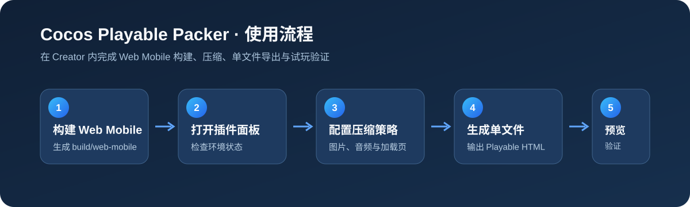

# Cocos Playable Packer

面向 Cocos Creator 3.8.x 的 Playable 单文件打包插件：一键将 Web Mobile 构建产物压缩、内联并导出为可交付的 HTML 文件。


## 功能介绍

### 解决的问题

投放 Playable 广告时，Cocos Creator 导出的 Web Mobile 工程通常包含大量分散的脚本、资源和配置文件；手工压缩、合并并制作单文件不仅耗时，也容易因遗漏资源或编码兼容性导致无法运行。本插件把这些流程收拢到 Creator 面板内，减少重复操作与交付风险。

### 主要功能

- 将 `build/web-mobile` 构建目录打包为单个 Playable HTML 文件。
- 自动内联运行所需的脚本、资源与配置，并使用 Brotli 压缩 Payload。
- 提供 Squoosh、TinyPNG、WebP、无压缩四种图片处理策略；可分别设置 PNG 与 JPG/JPEG 质量。
- 可选音频重新编码，按目标码率进一步降低音频资源体积。
- 提供 HTML7、Base91、Base64 三种 Payload 编码方式，其中 HTML7 为默认推荐选项。
- 可向最终 Playable 注入自定义 Logo 与蓝色加载进度条。
- 构建完成后展示体积对比、耗时等报告，并可直接浏览器预览或打开输出目录。

### 安装与使用前注意事项

1. 仅支持 **Cocos Creator 3.8.x**（`>=3.8.0 <3.9.0`）。
2. 请安装并配置 **Node.js 22 或更高版本**，确保在命令行执行 `node --version` 能返回版本号。
3. 如需启用 **音频压缩**，必须先安装 **FFmpeg** 并加入系统 `PATH`；请在命令行执行 `ffmpeg -version` 确认可用。插件会调用 FFmpeg 进行音频转码，Node.js/npm 不会自动安装它。建议同时执行 `ffmpeg -encoders`，确认输出包含 `libmp3lame`。

   Windows 已安装 Chocolatey 时，可在**管理员 PowerShell**中快速安装：

   ```powershell
   choco install ffmpeg
   ```

   安装后请重新打开 Cocos Creator，再执行 `ffmpeg -version` 验证。
4. 插件依赖随发行包附带的 Packer Runtime；请保持 `runtime` 目录及其内容完整，不要单独移动或删除。
5. 使用前须先在 Creator 中构建 **Web Mobile**，默认输入目录为项目的 `build/web-mobile`。
6. 若选择 TinyPNG，请自行准备有效的 TinyPNG API Key；该 Key 仅用于当前构建，不会写入构建报告或日志。
7. 使用 WebP 或音频压缩后，请务必在目标广告渠道的真机/WebView 环境试玩验证兼容性与音质。

## 使用教程



### Step 1：安装并启用插件

> 如果 Cocos Creator 无法自动解压或安装 ZIP，请手动解压 ZIP，并将其中的 `cocos-playable-packer` **整个文件夹**复制到项目的 `extensions` 目录。最终目录应为：`你的项目/extensions/cocos-playable-packer/package.json`。复制完成后重启 Creator，或在扩展管理器中重新加载插件。

将 `cocos-playable-packer` 文件夹放入 Cocos Creator 项目的 `extensions` 目录；重启 Creator，或在 **扩展管理器**中重新加载插件。随后通过菜单 **扩展 → Cocos Playable Packer → 打开打包面板** 启动插件。

### Step 2：构建 Web Mobile

在 Creator 的构建发布面板选择 **Web Mobile** 平台并完成构建。默认情况下，插件会检测项目下的 `build/web-mobile` 目录；若尚未构建，面板中的 Web Mobile 状态会提示未找到目录。

### Step 3：检查运行环境

打开插件面板后，先确认顶部状态卡均可用：Creator 项目、Web Mobile、Packer Core 和外部 Node.js。若 Node.js 显示异常，请安装 Node.js 22+ 后重启 Creator；若 Web Mobile 异常，请返回上一步重新构建。

### Step 4：设置输入与输出

在“路径与输出”区域：

1. 点击“选择目录”，选择 Creator 生成的 `build/web-mobile` 文件夹；
2. 点击“选择文件”，设定最终 HTML 的保存位置与文件名；
3. 建议输出到项目的 `build/playable/game.html`，便于与原始构建目录区分。

### Step 5：选择压缩与加载页策略

在配置卡片中按项目需求设置：

- **图片压缩**：首次使用建议选 Squoosh，PNG/JPG 质量设为 `80`；若优先排查问题可选“无压缩”。
- **音频压缩**：默认关闭；素材占比高时再开启，建议从 `48 kbps` 开始测试。
- **Payload 编码**：默认选 HTML7；遇到渠道兼容性问题可切换 Base64 进行排查。
- **Playable 加载界面**：启用后先导入 PNG、JPG/JPEG 或 WebP Logo（最大 40 KB），否则无法开始构建。

### Step 6：开始构建并查看报告

点击“开始构建”。构建期间配置会锁定，日志区域会显示实时进度。完成后，面板会显示最终 HTML 体积、节省比例、图片/音频处理结果和耗时统计。

### Step 7：预览与交付

点击“浏览器预览”试玩生成的文件，确认加载页、交互、音频与循环逻辑均正常；然后使用“打开资源目录”取得最终 HTML。提交广告渠道前，建议再在目标设备和渠道 WebView 中完成一次验证。

## 常见问题

### 面板提示“未检测到可用的外部 Node.js 22+”

安装 Node.js 22 或更高版本，确认 `node --version` 可用后重启 Cocos Creator。若 Node.js 不在系统 PATH 中，可将其可执行文件路径设置到环境变量 `PLAYABLE_PACKER_NODE`。

### 启用音频压缩后提示找不到 FFmpeg 或转码失败

请安装 FFmpeg，并将其可执行文件所在目录加入系统 `PATH`。关闭并重新打开 Cocos Creator 后，在命令行执行 `ffmpeg -version` 确认可用；若需要 MP3 转码，还应确认 `ffmpeg -encoders` 的输出中包含 `libmp3lame`。不启用音频压缩时不需要安装 FFmpeg。

### 面板提示“未找到 Web Mobile 构建目录”

请先在当前 Creator 项目中构建 Web Mobile，或在“输入目录”中手动选择正确的 `build/web-mobile` 文件夹。

### 为什么启用加载界面后无法构建？

启用“Logo 与蓝色进度条”时必须先导入 Logo；支持 PNG、JPG/JPEG、WebP，且文件不能超过 40 KB。若不需要加载页，可关闭该选项。

## 联系作者

- 邮箱：[yishionwang314@163.com](mailto:yishionwang314@163.com)
- 用户反馈：请通过上述邮箱提交问题，并附上 Creator 版本、插件版本、构建日志和可复现步骤。
- Cocos Store 反馈帖：商品发布后将在此补充官方 Store 专区链接，集中跟踪使用反馈与版本公告。

## 更新声明

### 1.0.0

- 首次发布 Cocos Creator 3.8.x Playable 单文件打包工作流。
- 支持图片、音频、Payload 编码与加载页配置。
- 新增构建报告、浏览器预览与输出目录快捷入口。

## 购买须知

本产品为付费虚拟商品，一经购买成功概不退款，请支付前谨慎确认购买内容。
